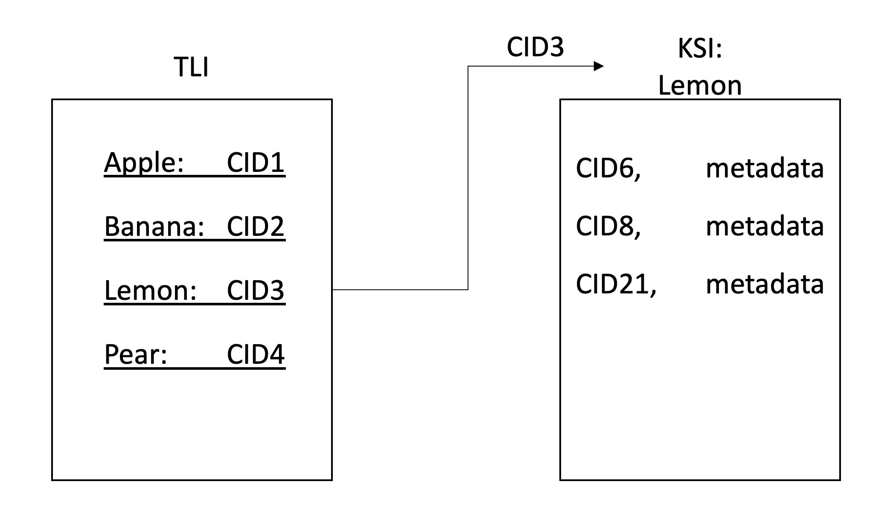
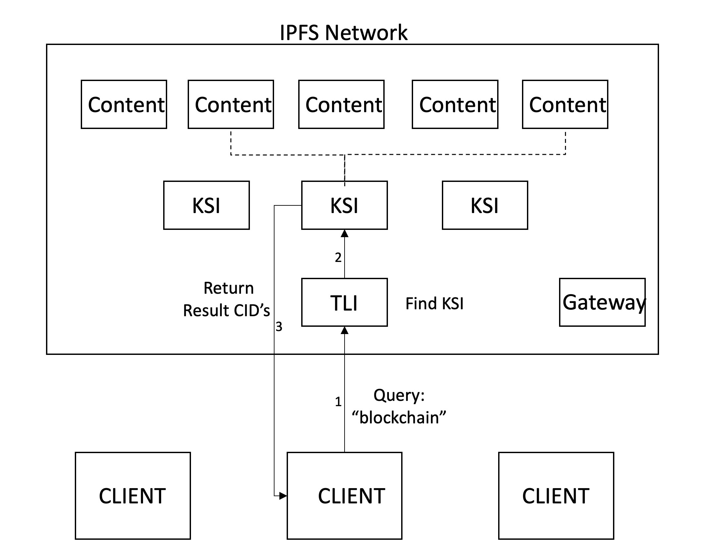
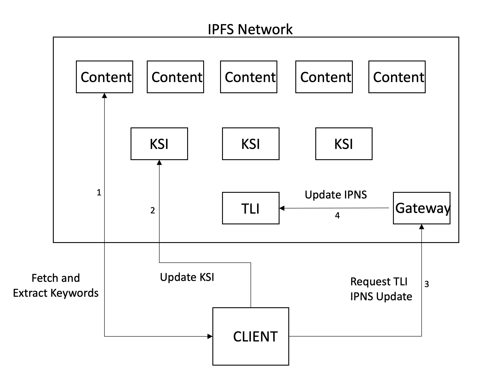

# Deece


Deece is a, open, collaborative, and decentralised search mechanism for IPFS. Any node running the client is able to crawl content on IPFS and add this to the index, which itself is stored in a decentralised manner on IPFS. This allows for decentralised search on decentralised content. A gateway to access functionality is implemented at www.deece.nl/web.  

(*The current implementation is still highly experimental. It only supports search and crawl on PDF's on IPFS, and requires delegation of trust to the gateway for updating the TLI entry. See [project status](#project status)*).

## Table of Contents

- [Overview](#overview)
  - [Motivation](#motivation)
  - [State-of-the-Art](#state-of-the-art)
- [Architecture Design](#architecture-design)
  - [Search](#search)
  - [Crawl](#crawl)
- [Components](#components)
  - [`Client`](#client) 
  - [`Gateway`](#gateway) 
  - [`Library`](#library)
- [Install](#install)
  - [`Client`](#client)
  - [`Library`](#library)  
- [Project Status](#project status)
- [Maintainers](#maintainers)
- [License](#license)


## Overview

Deece allows for decentralised search on IPFS data. This is achieved by a network of IPFS nodes who participate in crawling and indexing of the data on the network. The index is stored on IPFS, and split up into a two-layer hierachy, the first being the *Top Level Index* (TLI) and the second being the *Keyword Specific Indexes* (KSI). The TLI contains the identifiers (CID) for the KSI for each keyword, and is constantly updated when a node submits a crawl. When crawling, the nodes add to the current KSI a list of the identifiers of files that contain that keyword. 





Deece allows for two specifc actions: `search` and `crawl`. Search queries the latest TLI to find the KSI for each keyword in the user query, and then fetches the results from these, which are displayed to the user. Currently ranking of results is ordered based on CID, but more sophisticated mechanisms should be developed. We allow for combined results for up to two keywords, which will be extended in the future. 

There are currently three ways to access Deece. First, there is the client software which uses a command line interface. Second, we have implemented a gateway service(www.deece.nl/web), which runs an instance of our client node and allows "light clients" to interact with the search without installing other software. Finally, we have released our code used by the CLI and gateway in the form of a Go library.  

*The initial version of Deece relies on a trusted node (the same node as our gateway) to update the IPNS record pointing to the latest version of the TLI. When clients crawl, the final step involves them sending an update request to this server. At the moment, clients will need to specify a password in their config file, which can be obtained from the maintainers, as security measures will be implemented later.*


### Motivation

Currenly, Web users have few alternatives to *centralised* search engines. These engines maintain centralised control, policy and trust, which may lead to issues in censorship, privacy protection, and transparency. 

Furthermore, these engines generally focus their efforts on traditional Web content (hosted at Web servers, accessed through the DNS). However, in a Web3 paradigm, where content is expected to be stored at decentralised storage networks (s.a. IPFS) and name resolution to take place through blockchain solutions (s.a. ENS), an alternative search engine is required. 

In short, a search mechanism is needed which searches decentralised data, and does so in a decentralised manner. 


### State-of-the-Art

There are a number of comparable projects, which have attmpted to solve the problem of centraisation in Web search. First of all, there are implementations and proposals from research for distrubuted / decentralised search mechanisms for the current Web data. Early projects include Yacy, Faroo, and Seeks. More recently, Presearch aims to create a collaborative seach engine using blockchain rewards for incentives. 

Similarly, a number of works aimed to provide distributed seach for P2P storage networks. More recently, The Graph has built a decentralised indexing protocol for blockchain data using cryptocurrency incentives. 

However, none of the above projects entirely captures our specific use case of decentralised search for decentralised Web3 data. 


## Architecture Design

Our architecure relies on a number of client nodes, which collectively maintain and add to the index, and are able to perform searches. We have taken the approach of finishing a working protype of our architecture first, and adding features incrementally. Therefore, our current version relies on a trusted node (gateway) to update the TLI IPNS record. As there is no added security or incentivisation implemented, we have used a simple password to allow new client nodes to add to the index. 

- mention the assumptions: altruistic as we are only a prototype

In the future we envision there to be added security and incentives in place, which allign nodes to be honest when updating the index. These may be in the form of cryptocurreny rewards, slashing, reputation, etc. One way to fund rewards to honest nodes could be by incorporating advertisement into the protocol and allow advertisement fees to be delegated to the nodes maintining the network. 

Our current version only supports PDF files on IPFS to be added to the index. In the future, we would like to expand this to more file types and directories, and support different decentralised storage networks. Finally, we aim to incorporate blockchain based data such as smart contracts into search. 

We now present an overview of the two main operations in our mechanism.


### Search

Search starts with a query by the client containing a number of search terms. The client then fetches the latest TLI by resolving the IPNS name set by the gateway to the corresponding CID. This TLI is then fetched and traversed to check if the keywords have KSI's. If this is the case, the relevant KSI's are queries, to return the content that contains the keywords. The client can then retrieve these files from the network. 



One important aspect in search engines is the ranking mechanism. This generally happens in a centralised manner, without much influence from the clients. While we have not implemented sophisticated ranking mechanisms, we envision there to be ranking at the clients of the results, which gives them greater power and transparency. This allows clients to be in control of ranking functions and to personalise these based on specific needs. At present, our mechanism returns ordered results based on CID's. When two search terms are entrered, the pages where these both occur are returned first, after which the pages are returned which contain only one of the terms. 


### Crawl
-curation (currently only manual. envision in future to be automatic when visiting a page or content)
-crawl
-index
-add to tli




- mention ipns is slow and may become a performance bottleneck. Instead other mechanisms like dnslilnk, or blockchain based naming might be more appropriate. 


## Components

There are a number of ways to access Deece: 

### `Client`

The client software can be used by any node running IPFS, and provides a simple command line interface. 

```shell

NAME:
   Deece - Decentralised search for IPFS

USAGE:
   Deece [global options] command [command options] [arguments...]

VERSION:
   0.0.1

AUTHORS:
   Navin V. Keizer <navin.keizer.15@ucl.ac.uk>
   Puneet K. Bindlish <p.k.bindlish@vu.nl>

COMMANDS:
   search   Performs a decentralised search on IPFS
   crawl    Crawls a page to add to the decentralised index
   help, h  Shows a list of commands or help for one command

GLOBAL OPTIONS:
   --help, -h     show help (default: false)
   --version, -v  print the version (default: false)

```


### `Gateway`

For easy and lightweight access we have implemented a gateway for our search clients. This can be found at: www.deece.nl/web, and allows for search and crawls on the network based on identifiers (CID's).


### `Library`

Both the CLI and gateway run using our Deece package for Go. We have released this, as this can be used for easy integrations and extensions. 


## Install

- requirements (run daemon and constant connection to server for speed)
- password if intending to crawl
- file structure in folder: TLI, retrieved files, test_index

### `Client`


### `Library`


## Project Status


## Maintainers

- [@navinkeizer](https://github.com/navinkeizer/)
- [@igpkb](https://github.com/igpkb/)


## License


